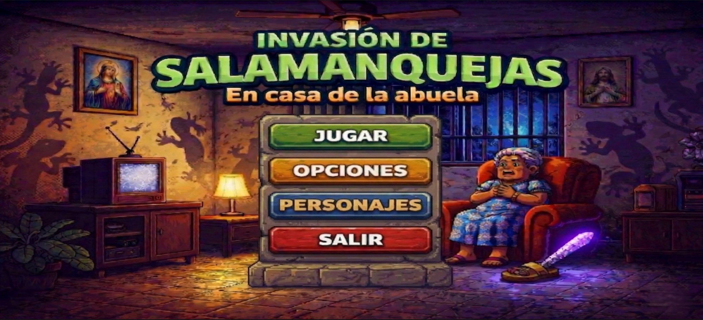
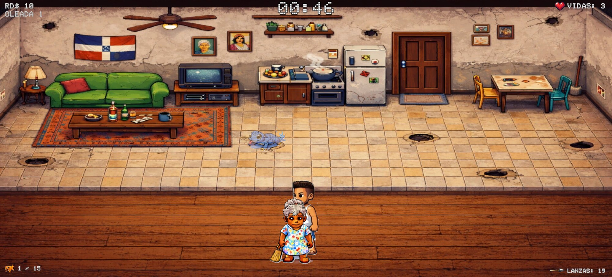
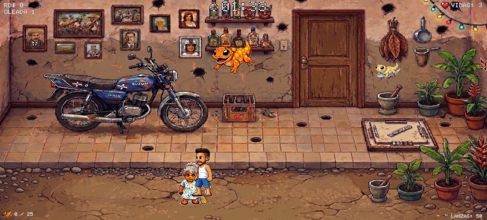
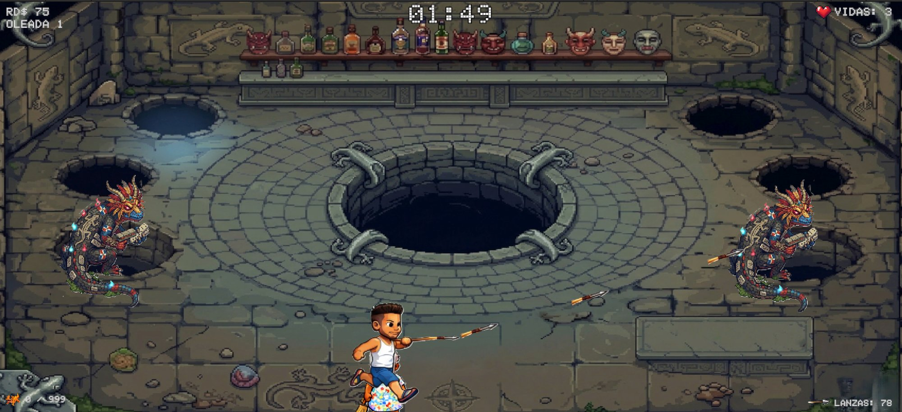

# Invasión de Salamanquejas 🇩🇴
### En casa de la abuela

Videojuego 2D de acción desarrollado en Unity 2022 para la materia **Programación de Videojuegos (ISW-414)** de la Universidad Central del Este.

---

## Autor

**Diego Alberto Castillo Zorrilla**  
Matrícula: 2023-0733  
UCE — Recinto Punta Cana  
Profesor: Ivan Zorrilla

---

## De qué va el juego

La abuela está sentada tranquila en su sala cuando una invasión de salamanquejas toma la casa. Diego, armado con lanzas, tiene que eliminarlas antes de que lleguen a ella. El juego tiene 3 niveles: la sala, el patio y una guarida final donde espera la Salamanqueja Madre junto a sus crías.

---

## Controles

| Acción | Control |
|---|---|
| Mover | WASD o flechas |
| Disparar lanza | Clic izquierdo (apunta al cursor) |
| Pausar | ESC |

---

## Niveles

| # | Escenario | Meta | Lanzas |
|---|---|---|---|
| 1 | Sala de la abuela | 15 salamanquejas | 20 |
| 2 | Patio de la casa | 25 salamanquejas | 50 |
| 3 | Guarida Final | 6 crías + Boss | 100 |

---

## Tipos de enemigos

| Tipo | Puntos | Característica |
|---|---|---|
| Normal | 10 RD$ | Estándar |
| Rápida | 25 RD$ | Poco tiempo visible |
| Resistente | 15 RD$ | Aguanta 2 golpes |
| Dorada | 50 RD$ | Muy escasa |
| Hija del Boss | 50 RD$ | 8 golpes para morir |
| Salamanqueja Madre | — | Barra de vida, 50 golpes |

---

## Capturas


*Menú principal*


*Nivel 1 — Sala de la abuela*


*Nivel 2 — Patio de la casa*


*Nivel 3 — Guarida Final con las crías del Boss*

---

## Características

- Menú principal con selección de personaje (Diego o Railyn)
- Panel de opciones con control de volumen y silencio
- 3 vidas que se mantienen entre niveles
- Puntuación acumulada en RD$ entre los 3 niveles
- 3 oleadas de dificultad progresiva por nivel
- La abuela sigue al jugador en todo momento
- Puerta se desbloquea al completar el objetivo
- Transición con fade negro entre niveles
- Panel de pausa con controles de audio
- Barra de vida del Boss Final
- Panel de victoria al derrotar al Boss
- Pantalla de Game Over con récord guardado
- Música y efectos de sonido

---

## Estructura del repositorio

```
CazadorDeSalamanquejas/
├── Assets/
│   ├── Audio/
│   ├── Prefabs/
│   ├── Scenes/          — MainMenu, Level_Sala, Level_Patio, Level_Final, GameOver
│   ├── Scripts/         — 15 scripts C#
│   └── Sprites/
├── Documentacion/
│   └── CazadorSalamanquejas_Castillo_2023-0733.pdf
├── Screenshots/
└── README.md
```

---

## Scripts

| Script | Función |
|---|---|
| GameManager | Estado del juego, vidas, puntos y oleadas |
| PlayerController | Movimiento, animaciones y disparo |
| Salamanqueja | Comportamiento de los enemigos normales |
| Spawner | Spawn de salamanquejas por oleada |
| SpawnerBoss | Lógica del nivel final con fases |
| FinalBoss | Comportamiento y barra de vida del boss |
| SalamanquejaHija | Enemigos del nivel final con mucha vida |
| UIManager | HUD, mensajes y panel de pausa |
| AudioManager | Música y efectos persistentes entre escenas |
| MainMenuController | Menú, opciones y selección de personaje |
| GameOverController | Pantalla final con récord |
| TransicionNivel | Fade a negro entre niveles |

---

## Documentación

`Documentacion/CazadorSalamanquejas_Castillo_2023-0733.pdf`

---

*ISW-414 Programación de Videojuegos · Universidad Central del Este · 2026*